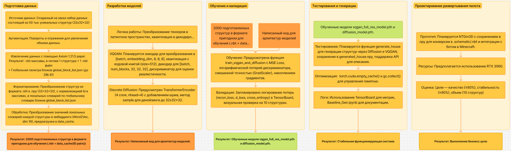
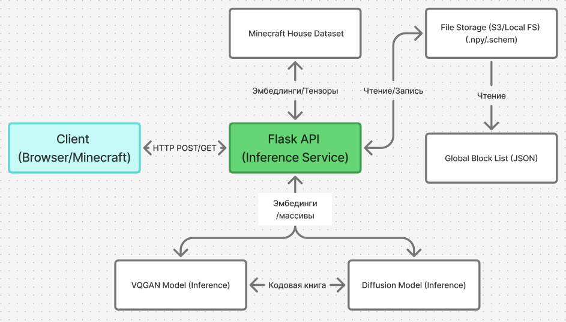

# Дизайн ML системы – NetTyan 3D Generator Module

## 1. Цели и предпосылки

### 1.1. Зачем идем в разработку продукта?

- **Бизнес-цель NetTyan 3D Generator Module (NTGm3D)**  
  *Owner – NetTyan team*  
  Команда NetTyan разрабатывает модуль для автоматической генерации 3D-структур (домов, замков, ферм) в среде Minecraft. Цель — ускорить создание структур по сравнению с ручным трудом игрока и обеспечить автономность процесса в рамках мультиагентной ИИ-системы, позволяя генерировать воксельные структуры на основе тегов (например, "wooden", "stone").

- **Почему станет лучше, чем сейчас, от использования ML**  
  *Product Owner & Data Scientist*  
  Текущий процесс создания структур в Minecraft требует ручного строительства или использования шаблонов, что занимает от 15 минут до нескольких часов и зависит от человеческого участия. Модуль NTGm3D с ML (VQGAN и Discrete Diffusion) автоматизирует генерацию, сокращая время до 1-5 минут на структуру, и поддерживает настройку стиля через теги, что повышает гибкость и креативность.

- **Что будем считать успехом итерации с точки зрения бизнеса**  
  *Product Owner*  
  Успехом итерации считается создание модуля, который генерирует воксельные структуры (32x32x32) в средневековом стиле, пригодные для реализации в Minecraft, за 1-5 минут, с возможностью настройки через теги (например, "wooden", "stone") и дальнейшей постройки ботом за 15-20 минут.

### 1.2. Бизнес-требования и ограничения

- **Краткое описание БТ и ссылки на детальные документы**  
  *Product Owner*  
  Модуль должен:  
  - Генерировать 3D-структуры (дома, замки, фермы) на основе тегов, задающих стиль (например, "wooden", "stone").  
  - Создавать воксельные массивы (32x32x32) в формате `.npy`, совместимые с Minecraft.  
  - Поддерживать интеграцию с ботом для построения структур в игре (внешняя реализация).  
  - Быть документированным и воспроизводимым для дальнейших доработок.  
  Детальные бизнес-требования отсутствуют, но основаны на текущем описании.

- **Бизнес-ограничения**  
  *Product Owner*  
  - Реализация должна быть завершена к 28 июня 2025 года (с учетом текущей даты — 07:30 PM CEST, 19 июня 2025).  
  - Ресурсы ограничены возможностями одного разработчика (Балицкий С.Д.) и ноутбука с GTX 3060 (8 ГБ памяти).  
  - Модель должна быть легкой, чтобы работать на доступном оборудовании (инференс < 5 минут).

- **Что ожидаем от итерации**  
  *Product Owner*  
  Минимально жизнеспособный продукт (MVP), который генерирует воксельные структуры в средневековом стиле на основе тегов и сохраняет их как `.npy` для последующей реализации ботом в Minecraft.

- **Описание бизнес-процесса пилота**  
  *Product Owner*  
  Модуль принимает теги (например, "wooden", "stone"), генерирует воксельную структуру (32x32x32), сохраняет ее в `.npy`, после чего бот (внешняя реализация) строит структуру в Minecraft в течение 15-20 минут.

- **Критерии успешного пилота и пути развития**  
  *Product Owner*  
  Успешный пилот: генерация 10 структур (5 домов, 3 замков, 2 ферм) в средневековом стиле за 1-5 минут каждая, с визуальным соответствием тегам в ≥ 80% случаев и стабильностью ≥ 90%. Развитие: добавление поддержки текстовых описаний через LLM, улучшение качества с метриками FID/SSIM (цели: FID < 50, SSIM > 0.8), оптимизация скорости и масштабирование на более мощных GPU.

### 1.3. Скоуп проекта/итерации

- **Закрываемые БТ**  
  *Data Scientist*  
  - Генерация воксельных структур (32x32x32) в средневековом стиле с использованием тегов.  
  - Сохранение результатов в `.npy` для интеграции с ботом.  
  - Анализ блоков в обучающих данных (`block_analysis.json`).

- **Незакрытые БТ**  
  *Data Scientist*  
  - Прямая обработка текстовых описаний (например, "средневековый дом с садом").  
  - Генерация сложных структур (например, мегастроений).  
  - Полная интеграция с ботом и конвертация в `.schematic`/`.nbt`.

- **Качество кода и воспроизводимость**  
  *Data Scientist*  
  Код документирован, структурирован и воспроизводим. Используются стандартные библиотеки (PyTorch, NumPy, Gensim) и управление памятью (`torch.cuda.empty_cache()`). Проект исследовательский, с потенциалом для доработки.

- **Технический долг**  
  *Data Scientist*  
  - Отсутствие метрик FID/SSIM (оценка визуальная).  
  - Нет интеграции с ботом и конвертации в `.schematic`.  
  - Ограниченная поддержка текстовых описаний (только API-запрос для описания результата).

### 1.4. Предпосылки решения

- **Общие предпосылки**  
  *Data Scientist*  
  - **Данные**: Воксельные структуры (32x32x32) в `.npy` файлах из `/content/Data/Output` (с поддержкой подпапок), палитра блоков в `global_block_list.json` (до 28000 уникальных ID).  
  - **Формат результата**: `.npy` файлы с ID блоков, совместимые с Minecraft.  
  - **Горизонт**: Генерация за 1-5 минут, построение ботом за 15-20 минут.  
  - **Обоснование**: VQGAN и Discrete Diffusion выбраны для генерации воксельных структур благодаря их способности обрабатывать 3D-данные, Word2Vec — для эмбеддингов блоков, теги — для управления стилем.

- **Структуры в Minecraft**  
  *Data Scientist*  
  Структуры — это 3D-сетки вокселей (32x32x32), где каждый воксель соответствует блоку с ID (например, камень, дерево). Модуль NTGm3D генерирует структуры в средневековом стиле (дома, замки, фермы), сохраняя их как `.npy` для последующей конвертации в `.schematic`/`.nbt` и реализации ботом. Структуры должны использовать стандартные блоки Minecraft и соответствовать эстетике игры.

## 2. Методология

### 2.1. Постановка задачи

- **Техническая задача**  
  *Data Scientist*  
  Разработка генеративной модели (VQGAN + Discrete Diffusion) для создания прототипа воксельных структур (32x32x32) в Minecraft на основе тегов ("wooden", "stone") с последующим улучшением. Модель преобразует эмбеддинги блоков (Word2Vec) в структуры, сохраняемые как `.npy`, для реализации ботом. На данном этапе акцент на техническую работоспособность, а не на высокое качество из-за ограничений GTX 3060.

### 2.2. Блок-схема решения

- **Бейзлайн (VQGAN)**  
  1. **Подготовка данных**: Загрузка `.npy` файлов (32x32x32), преобразование в эмбеддинги (Word2Vec, размерность 16), предзагрузка в `data_cache`.  
  2. **Модель**: VQGAN кодирует эмбеддинги в латентное пространство (8x8x8, codebook_size=512), квантизирует и декодирует в ID блоков (до 28000).  
  3. **Обучение**: MSE Loss для реконструкции, логарифмическая потеря и градиентный штраф для дискриминатора.  
  4. **Результат**: Воксельный массив (`.npy`) с ID блоков (в текущих условиях — шум).

- **MVP (VQGAN + Diffusion)**  
  1. **Подготовка данных**: Те же данные, с анализом блоков (`block_analysis.json`) и весами для тегов (`block_tags.json`).  
  2. **Модель**: Diffusion (DDIM, 500 шагов) генерирует индексы (8x8x8), VQGAN интерполирует до 32x32x32.  
  3. **Обучение**: MSE Loss для Diffusion, отдельно от VQGAN, с использованием `batch_size=2` и `accumulation_steps=8`.  
  4. **Генерация**: Поддержка тегов, сохранение в `.npy`, описание через API (опционально).  
  5. **Результат**: Структура (`.npy`) и описание (если есть API-ключ).

- **Блок-схема решения**  
  - 

### 2.3. Этапы решения задачи

#### Этап 1: Проектирование подготовки данных

- **Описание данных**  
  - Планируется использовать ~2000 воксельных структур (32x32x32) в `.npy` из `/content/Data/Output` (с подпапками), палитра блоков в `global_block_list.json` (до 28000 ID).  
  - Обработка: Предусмотрено преобразование в эмбеддинги (Word2Vec, размерность 16), создание `data_cache`.  
  - Метаданные: Запланированы `block_analysis.json` (статистика блоков) и `block_tags.json` (теги).  
  - Аугментация: Предполагаются повороты и отражения для увеличения объема данных.  
- **Проблемы и риски**  
  - Недостаток данных (~2000 вместо 12 тыс.), ограничения GTX 3060 (8 ГБ).  
  - Риски: Плохая генерализация, ошибки (NaN/Inf), низкое качество.  
- **Результат этапа**  
  - Подготовка инфраструктуры для ~2000 структур с возможностью масштабирования до 12 тыс.

#### Этап 2: Проектирование архитектуры моделей

- **Описание ML-метрик и функций потерь**  
  - Задача: Генерация структур (32x32x32) с тегами.  
  - Метрики: Планируется визуальная оценка (≥80%), стабильность (≥90%), время (1-5 минут).  
  - Потери: Предусмотрены MSE Loss и логарифмическая потеря дискриминатора.  
- **Структура моделей**  
  - VQGAN: Планируется энкодер для [batch, embedding_dim, 8, 8, 8], квантизация (codebook_size=512), декодер для [batch, num_blocks, 32, 32, 32], дискриминатор.  
  - Discrete Diffusion: Предусмотрен TransformerEncoder (4 слоя, nhead=4) с методом sample для денойзинга до 32x32x32.  
- **Результат этапа**  
  - Проектирование кода архитектур моделей для дальнейшей реализации.

#### Этап 3: Проектирование обучения и валидации

- **Схема обучения**  
  - Данные: Планируется ~2000 структур через DataLoader (batch_size=64).  
  - Процесс: Функция `train_vqgan_and_diffusion` с MSE Loss, логарифмической потерей, смешанной точностью (GradScaler), накоплением градиентов.  
- **Схема валидации**  
  - Планируется логирование потерь (recon_loss, d_loss, cross_entropy) в TensorBoard, визуальная проверка на 10 структурах.  
- **Результат этапа**  
  - Подготовка процесса для получения моделей `vqgan_full_res_model.pth` и `diffusion_model.pth`.

#### Этап 4: Проектирование тестирования и генерации

- **Описание**  
  - Планируется функция `generate_house` для генерации структур через Diffusion и VQGAN, сохранение в `generated_house.npy`, поддержка API для описания.  
  - Оптимизация: Предусмотрены `torch.cuda.empty_cache()` и `gc.collect()` для управления памятью.  
  - Логи: Запланировано использование TensorBoard для метрик, `Baseline_Gen.ipynb` для документации.  
- **Результат этапа**  
  - Ожидаемый вывод: Оценка качества (шум), необходимость мощных GPU, работоспособность.

#### Этап 5: Проектирование развертывания пилота

- **Описание**  
  - Планируется прототип NTGm3D с сохранением в `.npy` для конверсии в `.schematic`/.nbt и интеграции с ботом в Minecraft.  
  - Ресурсы: Предполагается использование GTX 3060, с учетом незавершенной интеграции.  
- **Оценка**  
  - Цели: Качество (≥80%), стабильность (≥90%), объем (10 структур).  
- **Результат этапа**  
  - Долгосрочные цели: Расширение данных до 12 тыс., внедрение FID/SSIM, LLM-поддержка, переход на GPU с 16+ ГБ (например, A100).

### 2.4. Специфические случаи

- **Обработка специфичных тегов**  
  - Для тегов с низкой частотой (например, "exotic" или "rare") планируется добавление весов в `block_tags.json` и аугментация соответствующих структур для балансировки данных.  
  - Ожидаемый этап: Интеграция в подготовку данных (Этап 1) с последующей адаптацией модели (Этап 2).

- **Генерация сложных структур**  
  - Для структур с высокой плотностью блоков (например, замки) планируется дополнительный слой интерполяции в Diffusion для повышения детализации.  
  - Ожидаемый этап: Интеграция в проектирование архитектуры (Этап 2) и тестирование (Этап 4).


## 3. Подготовка пилота

### 3.1. Способ оценки пилота

- **Дизайн и оценка**  
  Пилот проводится в Minecraft с ботом, интегрированным с NTGm3D. Процесс:  
  1. Ввод тегов ("wooden", "stone").  
  2. Генерация структуры (VQGAN + Diffusion, 32x32x32).  
  3. Сохранение в `generated_house.npy`.  
  4. Построение ботом (внешняя реализация).  
  Оценка:  
  - *Data Scientist*: стабильность (≥ 90%), отсутствие NaN/Inf.  
  - Билдеры: визуальное соответствие тегам (≥ 80%).

### 3.2. Что считаем успешным пилотом

- **Метрики**  
  - **Качество**: Соответствие тегам ≥ 80% (визуально).  
  - **Скорость**: Генерация 1-5 минут, построение 15-20 минут.  
  - **Уникальность**: Структуры отличаются от обучающих.  
  - **Стабильность**: ≥ 90% успешных генераций.  
  - **Объем**: 10 структур (5 домов, 3 замков, 2 ферм).

### 3.3. Подготовка пилота

- **Ресурсы**  
  - GTX 3060, `batch_size=2`, `accumulation_steps=8`.  
  - Обучение: ~1-2 часа на эпоху.  
  - Генерация: 1-5 минут.

- **Процесс**  
  1. **Анализ данных**: `block_analysis.json`.  
  2. **Датасет**: Предзагрузка `.npy` в `data_cache`, Word2Vec (`word2vec.model`).  
  3. **Обучение**: VQGAN и Diffusion (`vqgan_full_res_model.pth`, `diffusion_model.pth`).  
  4. **Генерация**: 10 структур с тегами, сохранение в `.npy`.  
  5. **Интеграция**: Конвертация в `.schematic` (внешняя), построение ботом.  
  6. **Тестирование**: Визуальная оценка, стабильность.

- **Результат**  
  - Прототип NTGm3D, 10 структур (`.npy`).  
  - Документация: TensorBoard, `block_analysis.json`.  
  - Анализ первых экспериментов: Первые тесты на 20 эпохах (стабилизация на 13-й) показали, что с GTX 3060 модель генерирует неструктурированный шум вместо домов. Начальные потери (G Loss=0.0359, D Loss=1.4714) снизились до ~0.05 и ~1.2, но качество не улучшилось. Это связано с малым объемом данных (1583) и ограниченной памятью GPU. Без долгого обучения на мощных GPU результат остается "кашей из блоков". На данном этапе мы стремимся к стабильности работы проекта, а не к идеальному результату на выходе.

- **Риски**  
  - Низкое качество → аугментация.  
  - Ошибки интеграции → проверка `.npy`.  
  - Ограничения GTX 3060 → уменьшение `codebook_size`.

## 4. Внедрение для production систем

### 4.1. Архитектура решения

#### Блок-схема
- **Блок-схема**  
  - 

#### Пояснения
Система **NetTyan 3D Generator Module (NTGm3D)** состоит из следующих компонентов:

1. **Client**:
   - **Назначение**: Интерфейс для пользователей (браузер, CLI, плагин Minecraft) для отправки запросов на генерацию структур.
   - **Методы API**:
     - `POST /generate`: Генерирует воксельную структуру (32x32x32) с использованием VQGAN и DiscreteDiffusion. Принимает JSON с тегами (например, `{"tags": ["wooden", "stone"]}`), возвращает `.schem` файл для скачивания и JSON с метаданными (пути к `.npy` и `.schem`, статистика блоков).
     - `GET /health`: Проверяет состояние сервиса, возвращает JSON с полем `status` (`available` или `unavailable`).
   - **Пример запроса**:
     ```json
     POST /generate
     Content-Type: application/json
     {"tags": ["wooden", "stone"]}
     ```
     **Ответ**:
     ```json
     {
         "status": "success",
         "npy_file": "/app/generated_house.npy",
         "schem_file": "/app/output_schem/generated_house.schem",
         "blocks": [
             {"id": 0, "name": "minecraft:air", "count": 1234},
             {"id": 1, "name": "minecraft:stone", "count": 567}
         ],
         "description": "House generated and converted to .schem successfully"
     }
     ```
     Возвращается файл `generated_house.schem` для скачивания.

2. **Flask API (Inference Service)**:
   - **Назначение**: Центральный сервис, обрабатывающий запросы на генерацию структур. Вызывает `MinecraftHouseDataset`, `VQGANFullRes`, `DiscreteDiffusion` для генерации, сохраняет результат в `.npy` и конвертирует в `.schem`.
   - **Вход**: JSON с тегами, файлы конфигурации (`global_block_list.json`, `block_tags.json`), модели (`vqgan_full_res_model.pth`, `diffusion_model.pth`).
   - **Выход**: `.npy` (32x32x32 воксельный массив), `.schem` (для Minecraft), JSON-ответ.

3. **File Storage**:
   - **Назначение**: Хранилище для входных данных (`global_block_list.json`, `block_tags.json`, модели, датасет) и выходных файлов (`.npy`, `.schem`).
   - **Реализация**: Локальная файловая система на этапе пилота, AWS S3 в продакшене.

4. **Global Block List (JSON)**:
   - **Назначение**: Словарь, сопоставляющий ID блоков с именами (например, `{"0": "minecraft:air", "1": "minecraft:stone"}`). Используется для генерации и конвертации в `.schem`.
   - **Формат**: JSON, до 28000 ID блоков.

5. **Block Tags (JSON)**:
   - **Назначение**: Связывает теги с именами блоков (например, `{"wooden": ["minecraft:oak_planks", "minecraft:oak_log"]}`) для управления стилем генерации.
   - **Формат**: JSON, опционально.

6. **VQGAN Model**:
   - **Назначение**: Кодирует эмбеддинги блоков в латентное пространство (8x8x8, codebook_size=512), квантизирует и декодирует до 32x32x32.
   - **Вход**: Эмбеддинги от `MinecraftHouseDataset`.
   - **Выход**: Индексы кодовой книги и реконструированные структуры.

7. **Discrete Diffusion Model**:
   - **Назначение**: Генерирует индексы кодовой книги (8x8x8) через денойзинг (500 шагов), которые VQGAN интерполирует до 32x32x32.
   - **Вход**: Случайные индексы, теги (через веса блоков).
   - **Выход**: Индексы для VQGAN.

8. **MinecraftHouseDataset**:
   - **Назначение**: Загружает `.npy` файлы (32x32x32) из `Data/Output`, преобразует ID блоков в эмбеддинги (Word2Vec, размерность 16), кэширует данные.
   - **Вход**: Путь к данным, `global_block_list.json`.
   - **Выход**: Тензоры эмбеддингов и маски.

---

### 4.2. Описание инфраструктуры и масштабируемости

#### Выбранная инфраструктура
- **Сервер**:
  - **Пилот**: Локальный ноутбук с Windows 10/11, NVIDIA GTX 3060 (8 ГБ VRAM), 16 ГБ RAM, 512 ГБ SSD.
  - **Продакшен**: Облачный сервер AWS EC2 (g4dn.xlarge: NVIDIA T4, 16 ГБ VRAM, 4 vCPU, 16 ГБ RAM).
  - **ОС**: Ubuntu 20.04 LTS (продакшен), Windows 10/11 (пилот).
  - **ПО**: Python 3.8+, Flask, PyTorch 2.0+, NumPy, nbtlib, Gensim, Docker.
- **Хранилище**:
  - Пилот: Локальная файловая система (`C:\Users\Nigger\Desktop\ML Disign\new`).
  - Продакшен: AWS S3 для хранения моделей, данных, `global_block_list.json`, `block_tags.json`, `.npy`, `.schem`.
- **Сеть**: Порт 5000 для Flask API, HTTPS в продакшене.

#### Почему выбрана эта инфраструктура
- **GTX 3060 (пилот)**: Доступное оборудование для разработки и тестирования, поддерживает инференс с batch_size=1 и смешанной точностью.
- **AWS EC2 g4dn.xlarge (продакшен)**: Обеспечивает 16 ГБ VRAM для стабильного инференса, масштабируемость через Auto Scaling.
- **Docker**: Гарантирует воспроизводимость окружения на Windows и Ubuntu.
- **S3**: Надёжное хранилище с высокой доступностью и шифрованием.

#### Плюсы и минусы
- **Плюсы**:
  - GTX 3060: Достаточно для пилота, низкие затраты.
  - EC2 g4dn.xlarge: Высокая производительность, поддержка CUDA, масштабируемость.
  - S3: Отказоустойчивость, автоматические бэкапы.
  - Docker: Упрощает деплой и тестирование.
- **Минусы**:
  - GTX 3060: Ограничение 8 ГБ VRAM, возможны проблемы с большими batch_size.
  - EC2: Стоимость (~$0.526/час или ~$380/мес).
  - Flask: Ограниченная асинхронность (решается Gunicorn+NGINX).
  - S3: Дополнительные затраты на запросы (~$0.1/10K операций).

#### Почему этот выбор лучше альтернатив
- **Альтернативы**:
  - **CPU-сервер**: Инференс в 5–10 раз медленнее, не подходит для генерации за 1–5 минут.
  - **Google Cloud (TPU/GPU)**: Сложнее в настройке, выше стоимость (~$0.6/час).
  - **FastAPI вместо Flask**: Асинхронность лучше, но Flask проще для MVP.
  - **Локальное хранилище вместо S3**: Ограниченная масштабируемость, риск потери данных.
- **Финальный выбор**: GTX 3060 для пилота минимизирует затраты, EC2+S3 для продакшена обеспечивают производительность и масштабируемость.

---

### 4.3. Требования к работе системы

- **SLA**:
  - **Доступность**: 99.9% (≤8 часов простоя в год).
  - **Восстановление**: ≤1 час (бэкапы на S3, мониторинг через CloudWatch).
- **Пропускная способность**:
  - Пилот: 5 запросов/мин (GTX 3060, batch_size=1).
  - Продакшен: 50 запросов/мин (EC2 g4dn.xlarge, Auto Scaling).
- **Задержка**:
  - Генерация одной структуры (32x32x32): 1–5 минут (GTX 3060), 30–60 секунд (EC2 T4).
  - Конвертация в `.schem`: ≤2 секунды.
- **Мониторинг**: Логи через `logging` (пилот), Prometheus+Grafana (продакшен) для метрик задержки, ошибок, использования VRAM.

---

### 4.4. Безопасность системы

#### Потенциальные уязвимости
- **Открытый API**: Отсутствие аутентификации в пилоте.
  - **Решение**: Внедрить JWT или API-ключи в продакшене.
- **Инъекции (XSS, JSON)**: Некорректная обработка входных тегов.
  - **Решение**: Валидация JSON через `jsonschema`, использование `flask-talisman` для заголовков безопасности.
- **DoS-атаки**: Перегрузка `/generate` из-за ресурсоёмкого инференса.
  - **Решение**: Ограничение скорости (rate limiting) через `flask-limiter`, балансировка через NGINX.
- **Утечка данных**: Доступ к моделям/данным через S3.
  - **Решение**: Шифрование S3 (AES-256), ограничение доступа через IAM.

---

### 4.5. Безопасность данных

- **GDPR и законы**:
  - Текущий функционал не собирает персональные данные (только теги и ID блоков).
  - **Риск**: Если в будущем добавится пользовательский ввод (например, ID игроков), потребуется:
    - Согласие на обработку (GDPR).
    - Шифрование данных в S3.
    - Удаление логов с IP-адресами.
  - **Решение**: Политика хранения (удаление через 30 дней), HTTPS, анонимизация логов.

---

### 4.6. Издержки

#### Расчётные издержки (на месяц)
- **Пилот (локальный ноутбук)**:
  - GTX 3060: $0 (уже имеется).
  - Электричество: ~$20 (300 Вт, 24/7).
  - Итого: ~$20/мес.
- **Продакшен (AWS)**:
  - EC2 g4dn.xlarge: ~$0.526/час × 720 часов = ~$380/мес.
  - S3 (100 ГБ, 10K GET/PUT): ~$2.4/мес.
  - CloudWatch (мониторинг): ~$10/мес.
  - Интернет: ~$5/мес.
  - Итого: ~$397.4/мес.
- **Оптимизация**:
  - Спотовые инстансы EC2: ~$150/мес (риск прерывания).
  - Квантование моделей: Снижение VRAM до 6–8 ГБ, переход на g4dn.small (~$0.2/час).

---

### 4.7. Integration points

- **Клиент → Flask API**:
  - **Метод**: HTTP POST `/generate` (JSON: `{"tags": ["wooden", "stone"]}`), HTTPS в продакшене.
  - **Ответ**: `.schem` файл (скачивание), JSON с метаданными.
- **Flask API → File Storage**:
  - Чтение: `global_block_list.json`, `block_tags.json`, модели (S3 `GetObject`).
  - Запись: `.npy`, `.schem` (S3 `PutObject`).
- **Flask API → Модели**:
  - `MinecraftHouseDataset`: Загрузка данных, эмбеддинги (Word2Vec).
  - `VQGANFullRes`: Кодирование/декодирование.
  - `DiscreteDiffusion`: Генерация индексов.
- **Внешняя интеграция**:
  - Бот Minecraft: Читает `.schem` из S3 для построения (вне текущего скоупа).

---

### 4.8. Риски

1. **Низкое качество генерации**:
   - **Причина**: Ограниченные данные (~2000 структур), GTX 3060 (8 ГБ VRAM).
   - **Решение**: Аугментация (повороты, отражения), переход на EC2 T4.
2. **Долгое время инференса**:
   - **Причина**: 500 шагов Diffusion, ограничения GTX 3060.
   - **Решение**: Смешанная точность, уменьшение `timesteps` до 200.
3. **Ошибки интеграции**:
   - **Причина**: Несовместимость `.schem` с Minecraft.
   - **Решение**: Валидация `global_block_list.json`, тестирование в WorldEdit.
4. **Перегрузка сервера**:
   - **Причина**: Высокая нагрузка на `/generate`.
   - **Решение**: Auto Scaling, очередь задач (Celery).
5. **Потеря данных**:
   - **Причина**: Сбой локального хранилища (пилот).
   - **Решение**: Ежедневные бэкапы на S3.